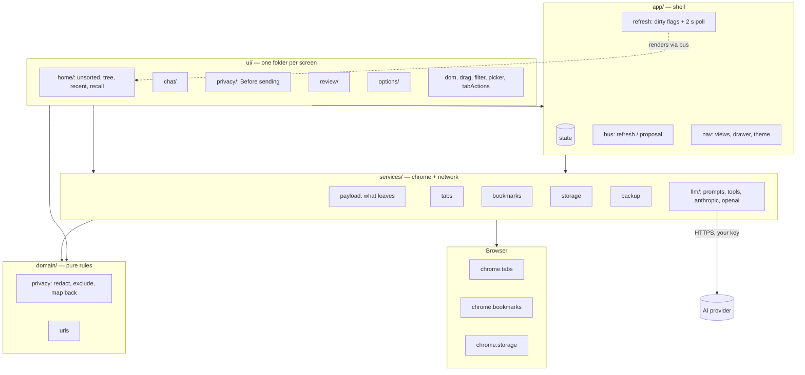
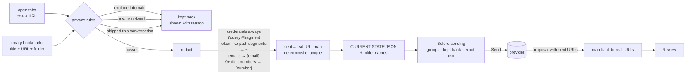
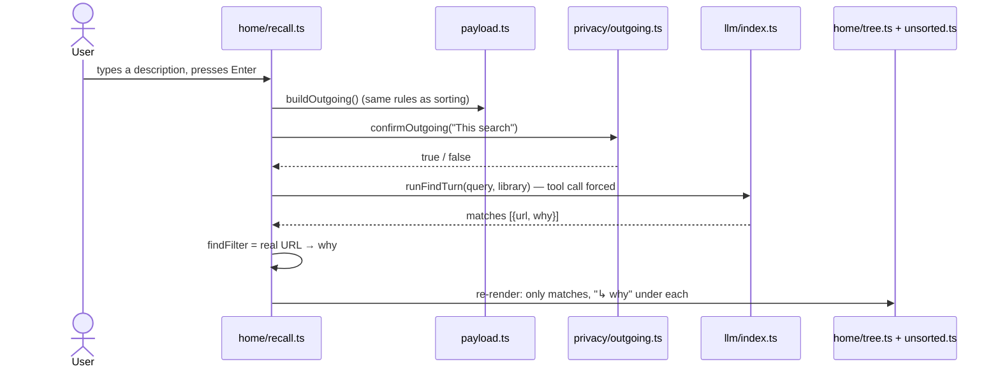
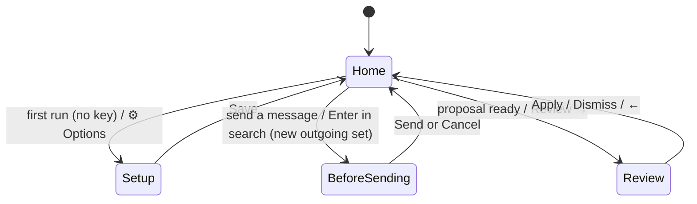

# Tab Librarian — architecture

A Chrome/Brave MV3 side panel. Bookmarks are the source of truth; the AI only ever *proposes*; nothing is applied without approval; nothing leaves the browser without passing one privacy module.

## 1. Components



Dependencies point inward: `ui → app → services → domain`. Screens never import each other; a screen that needs a re-render calls `requestRefresh()` and a new proposal is announced with `emit("proposal")`. `scripts/check-layers.mjs` fails the build on a violation or a cycle.

| Layer | Module | Owns |
|---|---|---|
| app | `state.ts` | the one shared mutable object (chat history, proposal, filters, expansion, privacy approvals) |
| app | `bus.ts` | `refresh` and `proposal` events; keeps renderers and actions decoupled |
| app | `nav.ts` | which view is visible, chat drawer, collapsible panels, theme |
| app | `refresh.ts` | chrome event listeners → dirty flags → 2 s poll → renderers; never renders mid-drag or with a picker open |
| domain | `privacy.ts` | domain exclusion, private-host detection, URL/title redaction, sent→real URL mapping, payload fingerprint |
| domain | `urls.ts` | URL normalization, sortability, domain of |
| services | `payload.ts` | builds the `CURRENT STATE` block after the privacy rules, plus what was kept back and why |
| services | `llm/` | provider dispatch (`index.ts`), prompts, strict tool schemas + sanitizers, one file per provider |
| services | `bookmarks.ts` | managed root, folder paths, apply/revert proposals, manual filing, moves, deletes, reconcile |
| services | `backup.ts` | snapshots (3-hourly, 7 days), export/import |
| services | `tabs.ts` | open tabs (incl. sleeping tabs), close safely, reopen, focus |
| ui | `privacy/outgoing.ts` | the "Before sending" step |
| ui | `chat/chat.ts` | one chat turn: gate → send → parse → announce proposal |
| ui | `home/recall.ts` | Enter in search → find by description → filtered lists with reasons |
| ui | `review/review.ts` | proposal tree with diff badges, questions, removals, apply/undo |

## 2. What leaves the browser



The preview is skipped only when the fingerprint of the outgoing set equals the last one the user approved in this session, so refining a proposal in chat does not re-ask; adding a tab does.

## 3. A chat turn

```mermaid
sequenceDiagram
  actor U as User
  participant C as chat.ts
  participant P as payload.ts
  participant O as privacy/outgoing.ts
  participant L as llm/index.ts
  participant D as domain/privacy.ts
  participant R as review.ts

  U->>C: message (or Sort chip)
  C->>P: buildOutgoing()
  P->>D: exclude / redact / map
  P-->>C: {text, tabs, bookmarks, keptBack, map, key}
  C->>O: confirmOutgoing(outgoing)
  alt key already approved this session, or previews off
    O-->>C: true
  else
    O->>U: Before sending (groups, kept back, exact text)
    U->>O: Send / Cancel
    O-->>C: true / false
  end
  C->>L: runChatTurn(history + text)
  L-->>C: text + submit_proposal(tool input)
  C->>D: mapProposalBack(proposal, map)
  C-->>R: emit("proposal")
  R->>U: Review: folders (with "Why: …"), questions, removals
  U->>R: Apply
  R->>R: applyProposal → bookmarks; undo data kept 5 s
```

## 4. Recall (Enter in the search box)



## 5. Views



## 6. Keeping the panel in sync

`chrome.tabs.*` and `chrome.bookmarks.*` events only set dirty flags. A 2-second poll renders when something is dirty, unless the user is mid-drag, has a folder picker or rename input open, or a proposal is being applied. A 30-second heartbeat catches anything the events miss (window focus changes, tabs restored from sleep).

## 7. Tests

| Layer | Where | Runs |
|---|---|---|
| Unit — the pure rules in `domain/` | `tests/unit/*.test.ts` (node:test) | `npm test`, and inside `npm run build` |
| Browser — every screen against a mock `chrome.*` | `tests/harness/*.test.js`, headless via DevTools | `npm run test:ui` |
| Evidence — one screenshot per step of the same flows | `tests/harness/evidence.mjs` | `npm run evidence` (output is not committed) |
| Architecture — layers and cycles | `scripts/check-layers.mjs` | inside `npm run build` |
